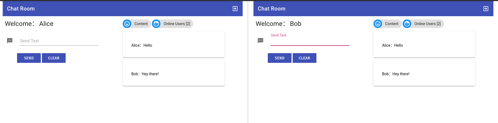
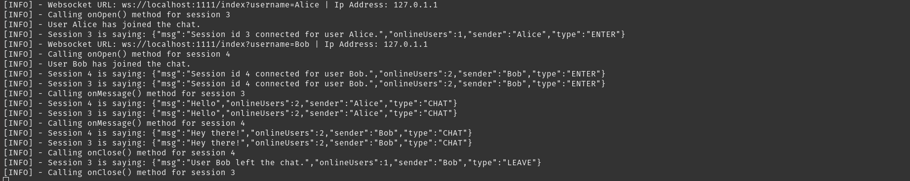

# wechat

Web chat with Spring using websockets and Thymeleaf as a templating engine with Jquery for the dynamic web behavior.

## Compile and package

Compile: `mvn compile`
Package: `mvn clean install`

## Run the application

Run: `mvn spring-boot:run`

The application starts at port 1111 (src/main/resources/application.yml) and first a login page is displayed.

The login does not require any authentication and once the Login button is clicked the user is redirected to the index/{username} page.

The Spring Java backend handles the requests using the ws (websocket) protocol.

